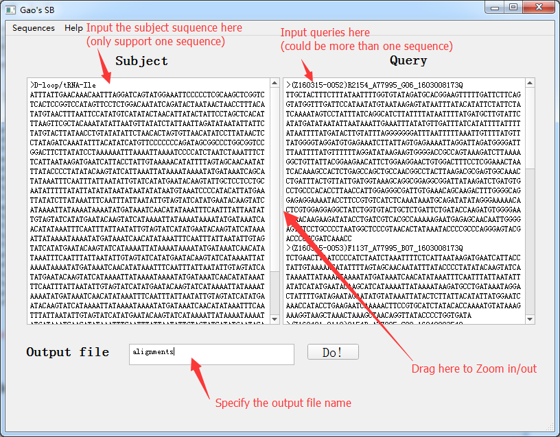
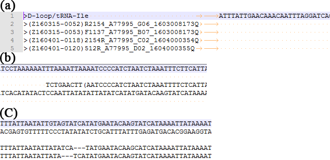
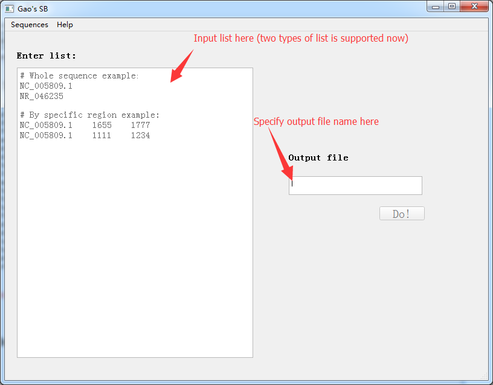
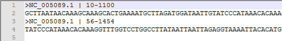
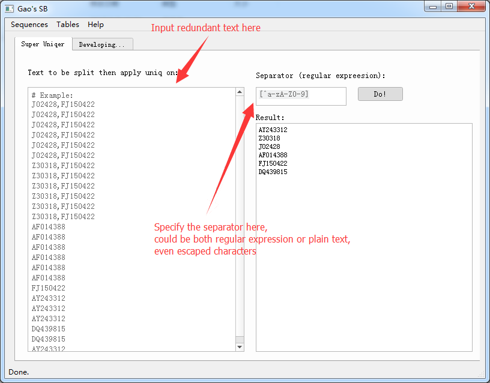

# Dr.***Gao's*** <i>**S**</i>trange requirement oriented tool <i>***B***</i>ox (**Gao's SB**)

A toolbox for bioinformatics works in Dr. Gao's lab. Also known as:

>Dr. <i>**G**</i>aoShan's <i>**a**</i>bnormal requirements <i>**o**</i>riented, <i>**S**</i>uper <i>**h**</i>umorous <i>**a**</i>nd <i>**n**</i>ot <i>**S**</i>cientific tool <i>**B**</i>ox

--By [Zhuoer Dong](https://github.com/Allan-Hilbert), with a little modification.

## Requirements
- None
- But currently only for *Windows* user

## Features
This application has the following features:
- Sequences tools
  - Batch align queries to a single reference, and generate a file containing alignments in format for (could be, but not limited to) supplementary files of publication.
  - Batch download sequence by *accession number* with specific base location.
- Tables tools
  - Remove all redundancy text in a list with configurable separator (could be [regular expression](https://en.wikipedia.org/wiki/Regular_expression) or plain-text containing [escaped characters](https://en.wikipedia.org/wiki/Escape_character))

## Known issues
- Since *MagicBlast* has been chosen as aligner, the boundaries of alignments may not as accurate as you think. 
It also can occur at `-` (a placeholder representing a base length, known as a deletion in query). 
You **should** check and modify the results yourself. 
**However, the program still saves you a lot of time.**
- The **exe** release may a little **big in size** now. I still cannot perform UPX compression on application based on PyQt now.

## Examples
### 1. Align queries to subject(single-sequence reference)
You may perform as following picture:

The result of this tool seems like:

(a) The file was opened in *notepad++*. Alignments were shown as in-line "fasta" format.

(b) The boundaries (softclip ending) of alignments were added parentheses for distinction.
**Warning: It may not accurate here, and correction by hands may needed.**

(c) The **insertion** (queries according to the subject) will be **deleted** and the **deletion** will be shown as `-`.
**Warning: It may also not accurate near *deletion*, and correction by hands may needed.**

### 2. Batch download sequence (could be specified base location)
You may perform as following picture:

The result of this tool seems like:

### 3. Remove text redundancy (could specify any separator)
You may perform then get results as following picture:

## Contributor
- [Yu Sun](http://icannotendure.space/)
- [Zhiguang Chen](https://github.com/Dgmaxxx) (May participate soon）

## TODO
- Add logo.
- Add icon.
- Perform UPX compression on certain dependencies for binary release.
- New feature: Batch extract sequences from *FASTA/FASTQ* file.
- Provide Installer release on *Windows* platform.

## Acknowledgement
Thanks for [Zhuoer Dong](https://github.com/Allan-Hilbert)'s suggestion on the name of this software.

## License
This project is released under the MIT license. See the included license file.